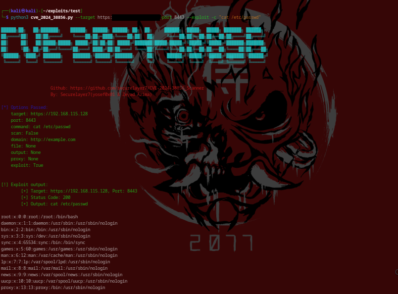

# CVE-2024-38856

For Ethical Usage only, Any harmful or malicious activities are not allowed. And it's your responsibility.

CVE-2024-38856: Apache OFBiz remote code execution Scanner & Exploit


The CVE Analysis: https://blog.securelayer7.net/cve-2024-38856-apache-ofbiz-rce

- This issue affects Apache OFBiz: through `18.12.14`
# Usage
```


 ██████╗██╗   ██╗███████╗    ██████╗  ██████╗ ██████╗ ██╗  ██╗     ██████╗  █████╗  █████╗ ███████╗ ██████╗ 
██╔════╝██║   ██║██╔════╝    ╚════██╗██╔═████╗╚════██╗██║  ██║     ╚════██╗██╔══██╗██╔══██╗██╔════╝██╔════╝ 
██║     ██║   ██║█████╗█████╗ █████╔╝██║██╔██║ █████╔╝███████║█████╗█████╔╝╚█████╔╝╚█████╔╝███████╗███████╗ 
██║     ╚██╗ ██╔╝██╔══╝╚════╝██╔═══╝ ████╔╝██║██╔═══╝ ╚════██║╚════╝╚═══██╗██╔══██╗██╔══██╗╚════██║██╔═══██╗
╚██████╗ ╚████╔╝ ███████╗    ███████╗╚██████╔╝███████╗     ██║     ██████╔╝╚█████╔╝╚█████╔╝███████║╚██████╔╝
 ╚═════╝  ╚═══╝  ╚══════╝    ╚══════╝ ╚═════╝ ╚══════╝     ╚═╝     ╚═════╝  ╚════╝  ╚════╝ ╚══════╝ ╚═════╝ 
                                                                                                            
                                                                                                                                                           
                                                                                                                                                              
                    Github: https://github.com/securelayer7/CVE-2024-38856_Scanner
                                By: Securelayer7(yosef0x01 & Zeyad Azima)                                     

usage: cve-2024-38856_Scanner.py [-h] [-t TARGET] [-p PORT] [-c COMMAND] [-s] [-d DOMAIN] [-f FILE]

CVE-2024-38856 Apach Ofbiz RCE Scanners.

options:
  -h, --help            Show this help message and exit.

  -t TARGET, --target TARGET
                        Specify the target host for the scan or exploit. This should be the IP address or domain name of the server you want to target.
  
  -p PORT, --port PORT  Specify the target port. This is the port on the target host where the vulnerable service is running (e.g., 8080).

  -c COMMAND, --command COMMAND
                        The command to execute on the target server if you are exploiting the vulnerability. This option is only used with the `--exploit` flag.

  -s, --scan            Perform a scan to check for the vulnerability on the specified target. The scan will use basic network commands like `ping`, `curl`, and `wget` to probe the target.
  
  -d DOMAIN, --domain DOMAIN
                        The domain or IP address to use when performing the scan. This is typically the attacker's domain that the target will interact with using commands like `ping`, `curl`, and `wget`. Defaults to `http://example.com` if not specified.

  -f FILE, --file FILE  Specify a file containing a list of targets. Each line in the file should be in the format `http(s)://target,port`. This option allows you to scan or exploit multiple targets in a batch mode.

  -O OUTPUT, --output OUTPUT
                        The file to save the results to. If specified, the results of the scan or exploit will be written to this file instead of being printed to the console.

  --proxy PROXY         Specify a proxy to route your requests through. The format should be `http://proxyhost:port` or `https://proxyhost:port`. This is useful if you need to route your traffic through an intercepting proxy like Burp Suite or if you need to hide your IP address.

  --exploit             Exploit the vulnerability on the specified target. When this option is used, the script will attempt to execute the command provided with the `-c` or `--command` option on the target server. This option must be used if you want to exploit the vulnerability rather than just scan for it.

  --timeout TIMEOUT     Specify the timeout in seconds for the HTTP requests made by the script. This controls how long the script will wait for a response from the target server before considering the attempt failed. Default is 10 seconds.

```
## Arguments

- `-t, --target <host>`: Specifies the target host. This cannot be used with the `--file` option.

- `-p, --port <port>`: Specifies the target port. Also, this option is required if the port is not specified in the targets file.

- `-c, --command <command>`: Specifies the command to execute on the target.

- `-s, --scan`: Enables scan mode. When this option is used, the script will perform a series of predefined commands (`ping`, `curl`, `wget`) on the specified domain.

- `-d, --domain <domain>`: Specifies your domain (attacker domain) to use in the scan with `ping`, `curl`, and `wget` commands. This option must be used with `--scan`.

- `-f, --file <file>`: Specifies a file containing a list of targets in the format `http(s)://target,port`. This option cannot be used with `--target`.

- `-O, --output <output_file>`:The output file for results.


`Global Port`: When scanning targets file, You can exclude `,port` and use `-p` to set a global port for all targets.

## Single Target

- Exploit Mode
```bash
python cve-2024-38856_Scanner.py -t <target> -p <port> -c "command" --exploit
```




- Scan Mode
```bash
python python cve-2024-38856_Scanner.py -t <target> -p <port> -s -d <domain> --scan
```


## Targets File

- Normal Mode
```bash
python exploit.py -f <file> -c "command"
```


- Scan Mode W/ Global Port
```bash
python exploit.py -f <file> -p <port> -s -d <domain>
```


# Screenshot:


